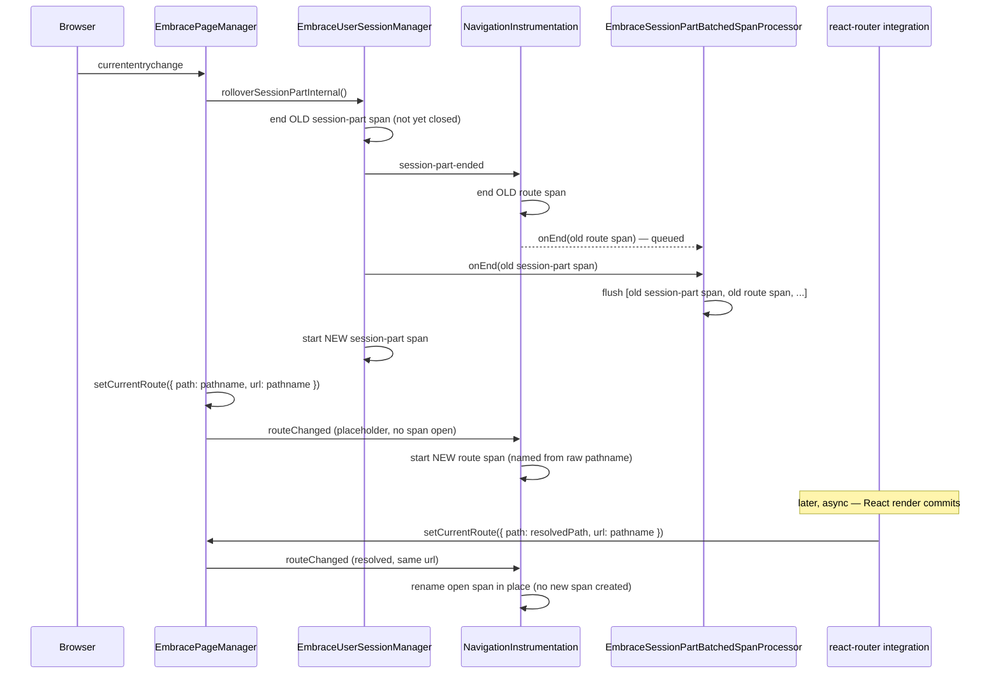

# EmbracePageManager

`EmbracePageManager` is the single source of truth for the current route,
and the sole listener of the Navigation API for soft-navigation detection.
Centralizing both in one place is what avoids the race that used to exist
between the session-part lifecycle and route-span creation: previously two
independent actors (the session manager reacting to the Navigation API, and
the navigation instrumentation reacting to route reports) could observe the
same soft navigation in either order. Now there's one actor driving both.

## Component responsibilities

- **`EmbracePageManager`** — holds the current route/page-id/label, listens
  to `window.navigation`'s `currententrychange`, and on every
  `setCurrentRoute` call notifies subscribers via `addRouteChangedListener`.
- **React-router integrations** (`withEmbraceRouting`,
  `withEmbraceRoutingLegacy`, `listenToRouterChanges`) — only ever call
  `page.setCurrentRoute({ path, url })` once they've resolved the templated
  route. They have no dependency on `NavigationInstrumentation` at all.
- **`NavigationInstrumentation`** — subscribes to `addRouteChangedListener`
  (mirrors route changes into `ux.surface` spans: same url → rename in place,
  different url → end the old span and start a new one) and to the
  session-part-ended listener (ends the open route span so it never outlives
  the session part it started in — e.g. the tab backgrounds with no further
  navigation). It never listens for session-part-*start*: resuming a span is
  handled purely by the next route report, not by the session-part
  lifecycle.
- **`EmbraceUserSessionManager`** — owns session-part start/end/rollover, but
  no longer knows the Navigation API exists.

## Soft-navigation flow

### Why the order inside `_onSoftNavigation` matters

`EmbraceSessionPartBatchedSpanProcessor` doesn't tag spans with a
session-part id — it queues every span as it ends and flushes the queue
whenever a session-part span ends. A span's attribution is therefore decided
by *ending order*, not by when it started.

`NavigationInstrumentation` ends its route span from the session-part-ended
listener, and `EmbraceUserSessionManager.endSessionPartInternal` fires that
listener **before** it calls `.end()` on the outgoing session-part span
itself. So `_onSoftNavigation` calls `rolloverSessionPartInternal` **before**
`setCurrentRoute`: the rollover ends the outgoing route span (via the
listener) while it's still open and still the correct one, so it's already
queued by the time the outgoing session-part span flushes. Setting the new
route first would end the outgoing route span directly (via the url change)
and start the new placeholder *before* the rollover — the session-part-ended
listener would then find the new placeholder open and incorrectly close it
instead of the outgoing span.

### Route spans never outlive their session part

Because `NavigationInstrumentation` also ends its span on session-part-end,
a route span always closes by one of two events, whichever comes first:

- a new route is reported (`_onRouteChanged` sees a different url), or
- the session part it started in ends, for *any* reason (soft nav,
  backgrounding, inactivity, manual `endUserSession()`).

Resuming a span on the next session-part-*start* was deliberately dropped:
if the same route is still current when a new part starts, the next
`setCurrentRoute` report (or, for frameworks that only report on navigation,
none at all) is what determines whether a span reopens — not the session
part boundary itself.
